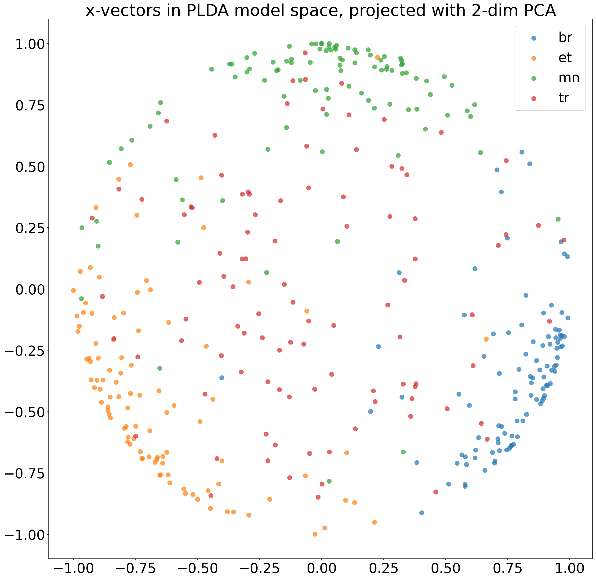

# lidbox

* Spoken language identification (LId) out of the box using TensorFlow.
* Parallel feature extraction using `tf.data.Dataset`, with STFT computations on the GPU using the `tf.signal` package.
* Only metadata (e.g. utt2path, utt2label) is fully loaded into memory, rest is done in linear passes  over the dataset with the `tf.data.Dataset` iterator.
* Spectrograms, source audio, and utterance ids can be written into TensorBoard summaries.
* Model training with `tf.keras`, some model examples are available [here](./lidbox/models).
* Average detection cost (`C_avg`) implemented as a `tf.keras.metrics.Metric`.
* You can also try `lidbox` for speaker recognition, since no assumptions will be made of the signal labels. E.g. use utt2speaker as utt2label and see what happens.

[Here](./examples/common-voice/common-voice-4.ipynb) is a full example notebook showing what `lidbox` can do.

## Why would I want to use this?

* You need a simple, deep learning based speech classification pipeline.
    For example: waveform -> VAD filter -> augment audio data -> serialize all data to a single binary file -> extract log-scale Mel-spectra or MFCC -> use DNN/CNN/LSTM/GRU/attention (etc.) to classify by signal labels
* You have thousands of hours of speech data
* You have a TensorFlow/Keras model that you train on the GPU and want the `tf.data.Dataset` extraction pipeline to also be on the GPU
* You want an end-to-end pipeline that uses TensorFlow 2 as much as possible

## Why would I not want to use this?

* You are happy doing everything with [Kaldi](https://github.com/kaldi-asr/kaldi) or some other toolkits
* You don't want to debug by reading the source code when something goes wrong
* You don't want to install TensorFlow 2 and configure its dependencies (CUDA etc.)
* You want to train phoneme recognizers or use CTC

## Installing

You need to have Python 3 installed.

### With the example

```
git clone --depth 1 https://github.com/matiaslindgren/lidbox.git
python3 -m pip install ./lidbox
```
Check that the command line entry point is working:
```
lidbox -h
```
If not, make sure the `setuptools` entry point scripts (e.g. directory `$HOME/.local/bin`) are on your path.

### Without the example

```
python3 -m pip install lidbox
```

### TensorFlow

TensorFlow 2 is not included in the package requirements because you might want to do custom configuration to get the GPU working etc.

If you don't want to customize anything and instead prefer something that just works for now, the following should be enough:
```
python3 -m pip install tensorflow
```

If everything is working, see [this](./examples/common-voice) for a simple example to get started.

### Editable install

If you plan on making changes to the code, it is easier to install `lidbox` as a Python package in setuptools develop mode:
```
git clone --depth 1 https://github.com/matiaslindgren/lidbox.git
python3 -m pip install --editable ./lidbox
```
Then, if you make changes to the code, there's no need to reinstall the package since the changes are reflected immediately.
Just be careful not to make changes when `lidbox` is running, because TensorFlow will use its `autograph` package to convert some of the Python functions to TF graphs, which might fail if the code changes suddenly.

## X-vector embeddings

One benefit of deep learning classifiers is that you can first train them on large amounts of data and then use them as feature extractors to produce low-dimensional, fixed-length language vectors from speech.
See e.g. the [x-vector](http://danielpovey.com/files/2018_odyssey_xvector_lid.pdf) approach by Snyder et al.

Below is a visualization of test set language embeddings for 4 languages in 2-dimensional space.
Each data point represents 2 seconds of speech in one of the 4 languages.



### PLDA + Naive Bayes classifier

There is a simple [language embedding classifier backend](./lidbox/embeddings/sklearn_utils.py) available.
To use it, you need to first install [PLDA](https://github.com/RaviSoji/plda):
```
python3 -m pip install plda@https://github.com/RaviSoji/plda/archive/184d6e39b01363b72080f2752819496cd029f1bd.zip
```
