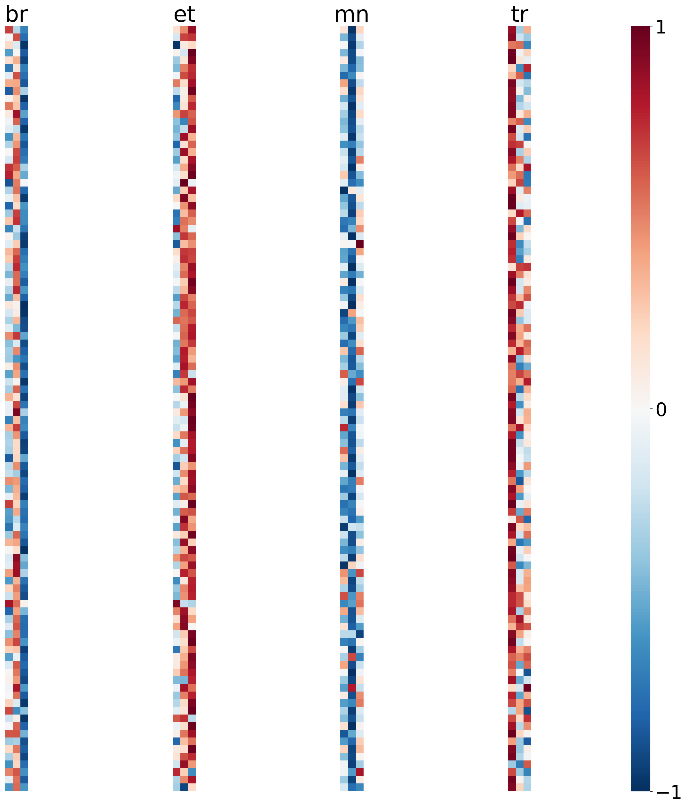

# Common Voice language identification example

This example shows how to create a language identification dataset from four [Mozilla Common Voice](https://voice.mozilla.org/en/datasets) datasets:
* Breton (br)
* Estonian (et)
* Mongolian (mn)
* Turkish (tr)

These datasets were chosen for this example because they do not contain too much data for a simple example (2-10 hours each), yet there should be enough data for applying deep learning.

If you want to experiment with other Common Voice datasets, update variable `datasets` in `scripts/prepare.bash` and key `labels` in `config.yaml`.

## Requirements

* [`bc`](https://www.gnu.org/software/bc)
* [`lame`](https://lame.sourceforge.io)
* [`python3`](https://www.python.org/downloads) 3.7 (due to TensorFlow 2.1)
* [`sox`](http://sox.sourceforge.net)
* [`tar`](https://www.gnu.org/software/tar)
* [`tensorflow`](https://www.tensorflow.org/install) 2.1 or newer

Python 3.8.2 with TensorFlow 2.2.0-rc2 has also been tested.

## Steps

### Prepare

1. Download the datasets from the [Common Voice](https://voice.mozilla.org/en/datasets) website into `./downloads`.
After downloading, the directory should contain the following files:
    * `br.tar.gz`
    * `et.tar.gz`
    * `mn.tar.gz`
    * `tr.tar.gz`

2. Run

        bash scripts/prepare.bash
    This will extract all mp3-files and convert them to 16k mono wav-files, which creates about 4G of data into directory `./data`.
    The script is very inefficient and the amount of file IO latency makes it unusable for larger datasets, but it will do for this small example.
    After the command completes, the mp3-files are no longer needed.
    It is not necessary to delete them, but you can do it if you want to:

        rm -r ./data/??/clips

### Train an x-vector model on log-scale Mel-spectrograms

3. Run the `lidbox` end-to-end pipeline

        lidbox e2e -v config.yaml
    You can enable debug mode by setting the environment variable `LIDBOX_DEBUG=true`, but note that this generates a lot of output.
    It also disables most of the parallel execution.

4. Inspect extracted features and training progress in TensorBoard by running:

        tensorboard --samples_per_plugin="images=0,audio=0,text=0" --logdir ./lidbox-cache/xvector/commonvoice-lang4/tensorboard
    Then go to the localhost web address that TensorBoard is using (probably http://localhost:6006).
    Take some time inspecting the data in all the tabs, e.g. look at the Mel filter banks under 'images' and listen to the utterances under 'audio'.

### Extract x-vector embeddings from the trained model and fit Gaussian Naive Bayes

5.

        lidbox train-embeddings -v config.xvector-NB.yaml

#### Randomly chosen x-vectors in the PLDA model space

#### 2-dim PCA projection

### Extra

6. Use a custom script to compute some stats on the test set:

        lidbox utils -v config.yaml --split test --run-script compute_stats.py

## Notes

* You can include any kind of dataset by using Kaldi-like metadata files, see contents of `./data/{train,test}` after running step 2.
* If you don't want to use a GPU, you can e.g. prefix all commands with `env CUDA_VISIBLE_DEVICES=-1`.
* Debug mode can be enabled by using the env var `LIDBOX_DEBUG=true`.
* Keep an eye on the memory usage if you are using large feature extraction batches, there's no kill switch for using too large batches.
* If you modify the config file, there's a JSON schema for validation, which can be checked with `lidbox utils -v --validate-config-file config.yaml`. This might give some useful or useless error messages.
